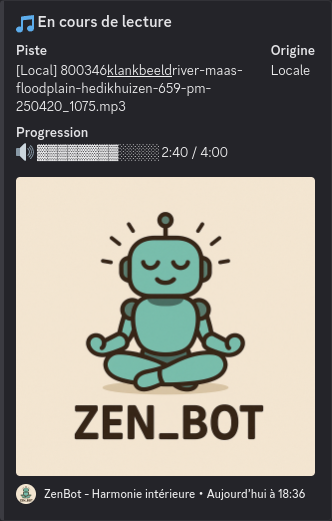

# 🎧 ZenBot – Musique de relaxation pour Discord


[](https://nodejs.org)
[](LICENSE)

ZenBot est un bot Discord qui diffuse aléatoirement des musiques de relaxation issues de fichiers locaux ou de l'API [Freesound.org](https://freesound.org). Il crée une ambiance zen dans un salon vocal et affiche un suivi de la lecture via des messages embed mis à jour.

---

## 🚀 Fonctionnalités

- 🎶 Lecture automatique de musique zen (locale ou via API)
- 🌐 Fallback intelligent en cas d’échec API
- 📊 Affichage en temps réel de la progression (barre de lecture)
- 🧘 Commandes slash intuitives (`/zen`, `/mode`, `/pause`, `/start`, `/next`, `/info`, etc.)
- 🗣️ Message vocal d'alerte si l’API échoue
- 🧩 Lecture en boucle automatique
- 🔁 Mode "API", "local" ou "mix"

---

## 🧪 Démo



---

## ⚙️ Installation

### 1. Cloner le repo

```bash
git clone https://github.com/ton_pseudo/zenbot.git
cd zenbot
```

### 2. Installer les dépendances

```bash
npm install
```

### 3. Ajouter un fichier `.env`

```env
TOKEN_DISCORD_BOT=your_bot_token
CLIENT_ID=your_client_id
GUILD_ID=your_guild_id
API_MUSIC_KEY=your_freesound_api_key
VOCAL_CHANNEL_ID=1234567890
TEXT_CHANNEL_ID=0987654321
```

### 4. Enregistrer les commandes slash

```bash
node deploy-commands.js
```

### 5. Lancer le bot

```bash
node index.js
```

---

## 🐳 Docker

### Build & run avec Docker :

```bash
docker build -t zenbot .
docker run -d --env-file .env zenbot
```

---

## 🧾 Commandes disponibles

Commande | Description
/zen | Lance une musique zen aléatoire
/mode | Choisit le mode : api, local, ou mix
/start | Relance la lecture si pause
/pause | Met en pause la musique
/stop | Arrête la lecture et quitte le vocal
/next | Passe à la piste suivante
/info | Affiche la piste en cours
/help | Rappelle la liste des commandes

---

## 🧠 Crédits

- Utilise [@discordjs/voice](https://www.npmjs.com/package/@discordjs/voice)
- API fournie par [Freesound.org](https://freesound.org/)
- Embeds créés avec Discord.js
- Suivi audio via `ffmpeg` et `fluent-ffmpeg`

---

## 📄 Licence

ZenBot est distribué sous licence MIT.
Tu peux le modifier, l’utiliser et le redistribuer librement.

---

*✨ Namaste, et que la paix soit avec tes oreilles.*
